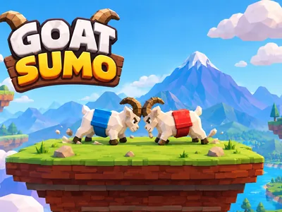
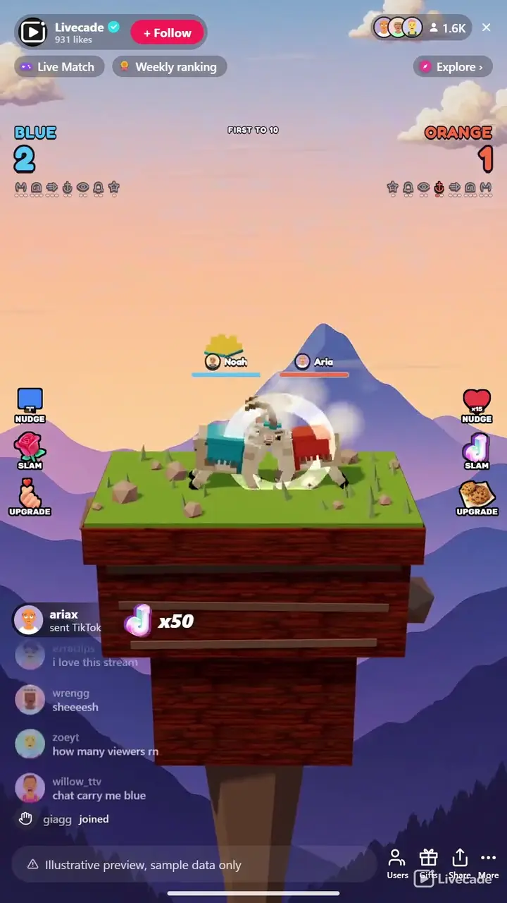

# Goat Sumo - Interactive TikTok Live Game

> Your chat pushes one goat, theirs pushes back, last one on the rock wins.

Two goats face off on a narrow mountain ledge and your chat decides who stays on it. A nudge is cheap and a slam is expensive, gifts buy stacking upgrades that take over the screen, and whoever keeps their hooves on the rock scores.

**[Play Goat Sumo on Livecade](https://livecade.io/games/goat-sumo/?utm_source=github&utm_medium=readme&utm_campaign=goat-sumo)** - runs as a single browser source in OBS, Streamlabs, or TikTok LIVE Studio. Nothing for viewers to install.

## How viewers play

Viewers take part with the actions TikTok already gives them: **comments**, **gifts**, **likes**, **follows**, **shares**. Every action below is rebindable, so you decide which interaction drives which effect.

| Action | What it does |
| --- | --- |
| **Nudge (per team)** | A small push on that team's goat, cheap enough to bind to comments or likes so the whole chat can join in |
| **Slam (per team)** | A full-power push that hits about 1.7 times harder than a nudge and wins a contested clash |
| **Upgrade (per team)** | Buys one of seven stacking upgrades for that team, announced on the full screen with the buyer's face and name |

## How it works

### Two goats, one ledge

A server-authoritative physics match on a narrow mountain ledge. Viewers push one goat or the other, and a side scores every time it puts the opponent over the edge. First to the knockoff target takes the match.

### Nudge cheap, slam to break a deadlock

A nudge comes from a comment or a like and costs nothing. A slam costs a gift and hits about 1.7 times harder. When both goats charge at once the charges cancel, so a slam is what wins a contested clash.

### Seven upgrades, announced on the full screen

Gifts stack seven upgrades onto a side, from harder horns to a bell that saves a goat mid-fall. Each one takes over the frame with the buyer's face and name while the match keeps running behind it.

### The leader wears it

A crown at one clear, then a cape, shades and an aura as the lead grows, shed again as the other side claws back. The goats show the score, so it reads at a glance on a phone.

## About the game

Goat Sumo puts two goats on a ledge over a very long drop and hands the pushing to your viewers. One side is yours, one side is theirs, and every push from chat moves a real goat in a physics simulation running on our servers. First team to the knockoff target wins the match.

### A cheap push and an expensive one

Viewers have two ways to shove. A nudge costs almost nothing and comes from comments or likes, so anyone watching can join in immediately. A slam costs a gift and hits about 1.7 times harder, which matters because the two goats can charge at the same time: equal charges cancel out and nothing moves, so a slam is what breaks a stalemate a hundred nudges could not.

### Gifts buy horns, and the whole screen says who paid

Gifts also buy seven stacking upgrades: Iron Horns hit harder, Battle Helm takes less, Battering Ram lunges further, Ledge Anchor slides less, Hazard Sense shrugs off falling rocks, Guardian Bell hauls a goat back from the brink, and Golden Horns are just for show. Every purchase takes over the full frame with the buyer's face and name on it, and the game keeps playing behind the card instead of freezing. A power row under each score shows which upgrades still have room, so nobody spends on one that is already maxed.

### Falling rocks, and a crown for whoever is winning

Boulders drop and lightning strikes, both warned first by a ring on the ground so a viewer can see it coming and read what happened. The leading goat earns a crown, then a cape, then shades, then an aura as its lead grows, and loses them again as the gap closes. On a phone the scoreboard is small and the goat is big, so anyone scrolling past can tell who is winning without reading a number.

## What it looks like on stream

[Watch Goat Sumo gameplay](https://cdn.livecade.io/games/goat-sumo.mp4)

## What you can configure

- **Interface language** - Twelve languages for the on-screen chrome, the upgrade names included
- **Team names and colors** - Name and free hex color for each side, shown on the scoreboard and worn by the goat
- **Arena** - Twenty mountain backdrops. Purely a look: picking one never changes the ledge or the hit power
- **Ledge width** - Narrow, standard, wide or huge. A narrow ledge makes every push a threat
- **Hit power** - Gentle through brutal, scaling how far a landed hit moves a goat
- **Knockoffs to win a match** - One to a thousand, so a match can last a minute or a whole stream
- **Nudge and slam strength** - The charge each push contributes, if you want the gap between cheap and expensive wider or narrower
- **Hazards** - Falling rocks and lightning, each off, light, normal or heavy, both warned by a ground ring first
- **Scenery** - Clouds, mountain ridges, snow, wind streaks and circling birds, each toggled on its own
- **Background** - Your own image behind the fight, replacing the arena sky
- **Win celebration** - Cinematic with a dim and a shake, subtle, or minimal

## Languages

English, Spanish, Portuguese, French, German, Italian, Indonesian, Arabic, Turkish, Russian, Hindi, Romanian

## FAQ

<strong>How do viewers play Goat Sumo?</strong>

They push. Every action is rebindable, so a comment, a like, a follow, a share or a gift can all move a goat. By default a nudge is cheap enough to put on comments or likes so anyone watching can take part straight away, and a slam or an upgrade costs a gift.

<strong>Do viewers have to send gifts?</strong>

No. Nudges are free and a team of nudgers can absolutely win. Gifts buy slams, which hit about 1.7 times harder and break a deadlock when both goats charge at once, and they buy the seven upgrades, so gifting decides the close matches rather than gating entry.

<strong>What happens if someone gifts an upgrade that is already maxed?</strong>

The gift turns into a full-power slam instead of being swallowed, so the coins still move the goat and the sender still gets their name on screen. The power row under each score also shows which upgrades still have room, so it is visible before they spend.

<strong>Does the game stop every time someone buys an upgrade?</strong>

No. The upgrade card takes over the full frame with the buyer's face and name, but the goats keep fighting behind it. Freezing on every purchase would stall a busy stream exactly when it is going best.

<strong>How do I add Goat Sumo to my TikTok Live?</strong>

Add one browser source URL to OBS or your streaming software and go live. There is no plugin to install and nothing for your viewers to download. Goat Sumo renders in 3D, so give it a reasonably modern machine.

## Setup

1. [Create a Livecade account](https://app.livecade.io/register?utm_source=github&utm_medium=cta&utm_campaign=goat-sumo)
2. Copy your overlay browser source URL
3. Paste it into OBS, Streamlabs, or TikTok LIVE Studio
4. Pick Goat Sumo, set your triggers, and go live

Runs in the browser, so it works on Windows and macOS with nothing to download. [See all TikTok Live games](https://livecade.io/tiktok-live-games/?utm_source=github&utm_medium=readme&utm_campaign=goat-sumo).

---

_This repository documents Goat Sumo, a hosted interactive game by [Livecade](https://livecade.io/?utm_source=github&utm_medium=footer&utm_campaign=goat-sumo). The game runs on Livecade's platform, so there is no source to install here._
